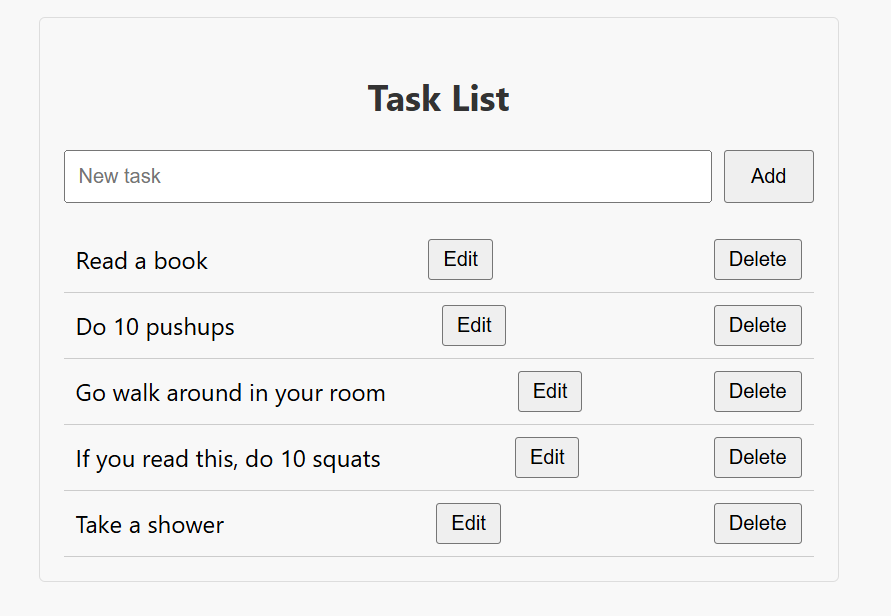

# Task Manager

Status: Finished.

Full-stack task management app with React frontend and FastAPI backend.



## Project Structure

```
project/
├── frontend/          # React + TypeScript
└── backend/           # FastAPI + PostgreSQL
```

## Tech Stack

**Frontend:**
- React 19 + TypeScript
- CSS Modules
- Jest + Testing Library

**Backend:**
- FastAPI + SQLAlchemy
- PostgreSQL
- Alembic (migrations)
- Pytest

## Setup

### Backend

```bash
cd backend
pip install -r requirements.txt

# Configure PostgreSQL
createdb factorytasks
psql factorytasks -c "CREATE SCHEMA factorytasks_schema;"

# Run migrations
alembic upgrade head

# Start server
uvicorn app.main:app --reload
```

### Frontend

```bash
cd frontend
npm install
npm start
```

Frontend runs on `http://localhost:3000`  
Backend runs on `http://localhost:8000`

## Testing

```bash
# Backend tests
cd backend
pytest -v

# Frontend tests
cd frontend
npm test
```

## Features

- Create, read, update, delete tasks
- PostgreSQL with custom schema
- Full test coverage
- Type-safe with TypeScript and Pydantic
- Follow clean code best practices throughout the project
